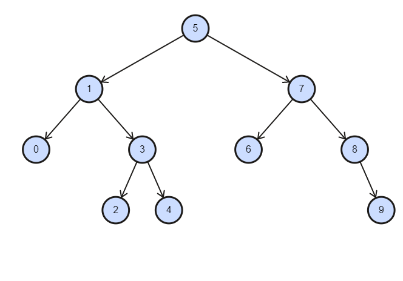

# Binary Search Tree Projesi

## [7,5,1,8,3,6,0,9,4,2]

#### **Dizinin Binary-Search-Tree aşamalarını yazınız.**

Dengeli bir ağaç oluşturmak için kökü **5** ya da **4** seçmek ideal olacaktır. Kökün *5* olduğu bir ağaca dizinde indeks sırasına göre eleman alırsak;

                 [5]
        [1]                [7]
    [0]      [3]        [6]    [8]
          [2]   [4]                [9]

         
                               
