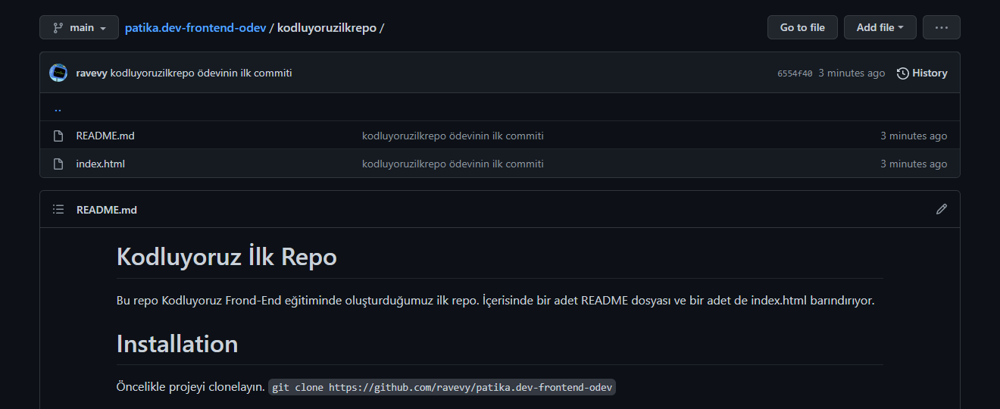

# Kodluyoruz İlk Repo
Bu repo Kodluyoruz Frond-End eğitiminde oluşturduğumuz ilk repo. İçerisinde bir adet README dosyası ve bir adet de index.html barındırıyor.


# Installation
Öncelikle projeyi clonelayın. 
```
git clone https://github.com/ravevy/patika.dev-frontend-odev
```

# Usage
Projeyi cloneladıktan sonra Visual Studio Code programında açınız.
Linux için:
```
cd patika.dev-frontend-odev/kodluyoruzilkrepo
code .
```

# Contributing
Pull requestler kabul edilir. Büyük değişiklikler için, lütfen önce neyi değiştirmek istediğinizi tartışmak için bir konu açınız.

# License
[MIT](https://choosealicense.com/licenses/mit/)
